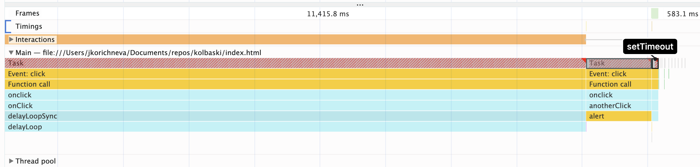

# Example with async call and setTimeout + user click

## Performance image

## What is happening:

On the click of the button we are calling onClick function which is executed as one task (long task). 
Even though our callAsyncApi is in a separate function it is still in one task with the sync loop code. 
When the function is going into the sync loop we click on the second button that should trigger the alert. 
We can see that the code is not executed during the looping and alert is only fired when the main thread is released.
The setTimeout callback is scheduled after the user input handling because the Web API has put it into the queue task and it has waited until the stack was empty (after the user input handling).
