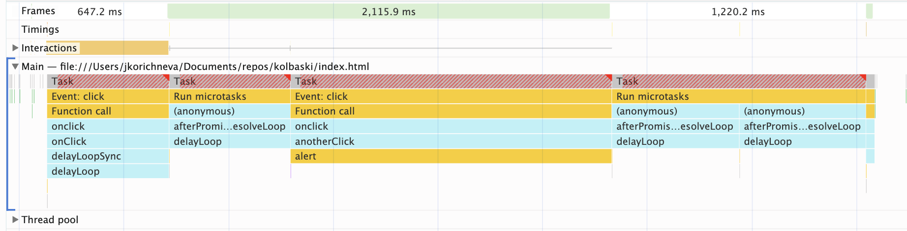
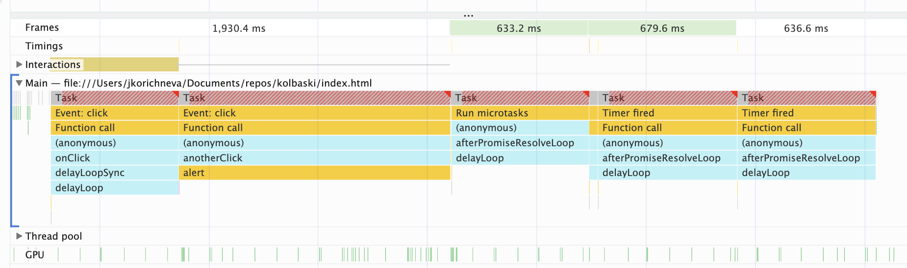

# With long Microtasks

We add longer loops into the callbacks after fetch. We see that the microtasks are starting to block user input.

If we add setTimeout to the callbacks then the user input is not being blocked and the tasks are being put as macrotasks in the queue.

