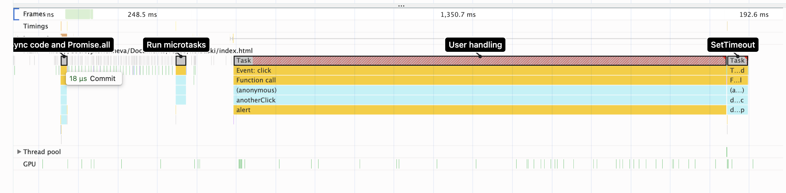
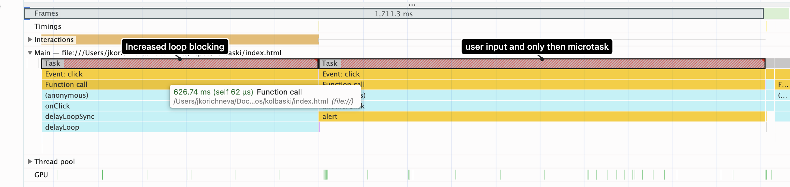
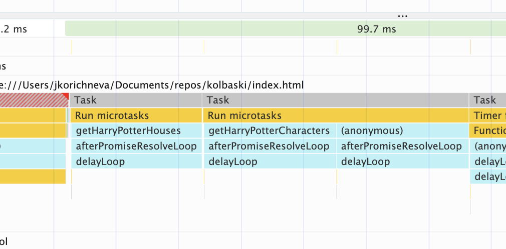
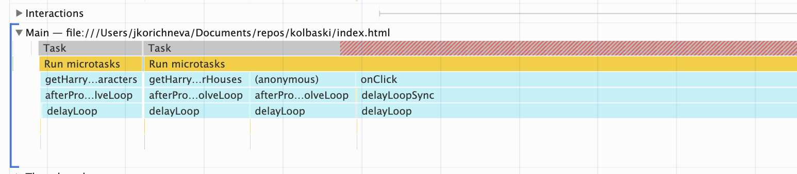

# Example with fetching via Promise.all()

## What is happening:
We put two promises into Promise.all() and after they are resolved we execute some code via .then().

If we have a longer blocking task in the event loop the callback for the Promise.all() is being put into the call stack after the main thread is empty.
As expected, it is executed before setTimeout callback as it is a microtask.

If we add the long sync code after each promise then we still see that this is handled within a microtask, the final Promise.all microtask 
callback is longer because it includes both last promise callback code & Promise.all callback code.

If we add await before Promise.all, then the microtasks are executed first and the last microtask is united with the sync code:

If we rewrite the functions for Harry Potter fetching in a fetch().then() way, the result is the same, the callback is put into the 
microtask.
